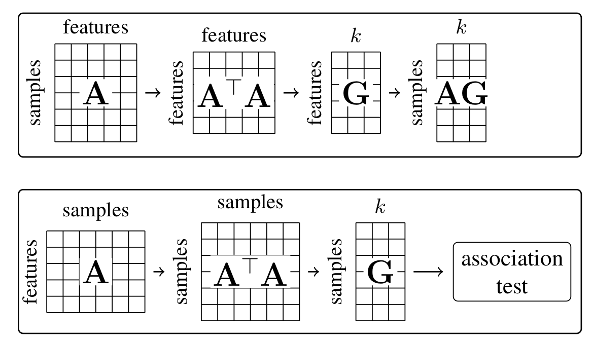

# Federated Principal Component Analysis

Principal component analysis is conceptually the eigendecomposition of the covariance matrix. While there are efficient covariance free algorithms for the compuation of the PCA, for instance singular value decomposition of the data matrix, it is useful to use this traditional representation.

## Data partionining
In federated learning the data is distribtued over several data holders ('sites'). The data can be distributed in different ways. Either the samples are distributed, but every site has all variable for all samples ('horizontal data partitioning'), or the variables  are distributed so that every site has a different subset of measurements for all samples ('vertical data partitioning'). Depending on the data distribution, different types of principal component analysis are required, due to the way the covariance matrix is formed. For sample stratification this situation is even more complicated, because the PCA is done on the sample by sample covariance matrix, but the samples are distributed which means the PCA is conceptually done on vertically partionned data, although it looks like the data is horizontally partionned. See the figure for illustration.

### Vertical data partititioning
The specific use case for principal component analysis handeled by this version of principal component analysis is patient stratification for medical data. This is a very special use case, where the patients are distributed over serveral sites, which cannot share their data. Unlike 'feature' reduction PCA, where one wants to compute a lower dimensional approximation of the feature-by-feature covariance matrix, the PCA in GWAS is computed on the sample-by-sample covariance matrix. The samples are distributed over several sites, therefore the covariance matrix cannot be computed directly. It is not desirable to compute this covariance matrix, because the number of samples in a GWAS cohort can become quite large. Therefore here, we describe a covariance free alternative.

Library code for the simulation of vertical federated PCA (for sample stratification) is available in [vertical](/python/PCA/vertical). The folder [misc_scripts](/misc_scipts) contains examples on how to run the code and a basic workflow. Dependencies are managed using a conda environment and can be installed using [environment.yaml](./environment.yaml).

### Horizontal data partitioning
PCA that deals with classicial feature reduction PCA has been evaluated. There are several algorithms available with different aims [2]. there are approximate algorithms and exact algorithms. Approximate algorithms have little communication overhead, exact algorithms have a higher number of required communication rounds, with the obvious advantage that they converge to the centralised solution.
Simulation code for horizontal PCA is available in [horizontal](/python/PCA/horizontal). Notebooks and figures for an illustration of federated horizontal using single-cell-transcriptome data is available in [notebooks](/python/PCA/notebooks). 

### Efficient federated SVD
PCA can be applied to high dimensional data in a low number of communication rounds (depending only on the number of singular vectors, and in practice these usually are chosen low), and without computing the covariance matrix. For more information please refer to [3].

## Citation
If you use this repository in your work please use one of the following references:

<a id="1">[1]</a>
Hartebrodt, A., Nasirigerdeh, R., Blumenthal, D. B., & Richard, R. (2021). Federated Principal Component Analysis for Genome-Wide Association Studies. Icdm<, 1090–1095. https://doi.org/10.1109/ICDM51629.2021.00127

<a id="1">[2]</a>
Anne Hartebrodt, Richard Röttger, Federated horizontally partitioned principal component analysis for biomedical applications, Bioinformatics Advances, Volume 2, Issue 1, 2022, vbac026, https://doi.org/10.1093/bioadv/vbac026

<a id="1">[3]</a>
Hartebrodt, A., Röttger,R. and Blumenthal, D., 2022. Federated singular value decomposition for high dimensional data. arXiv preprint arXiv:2205.12109
